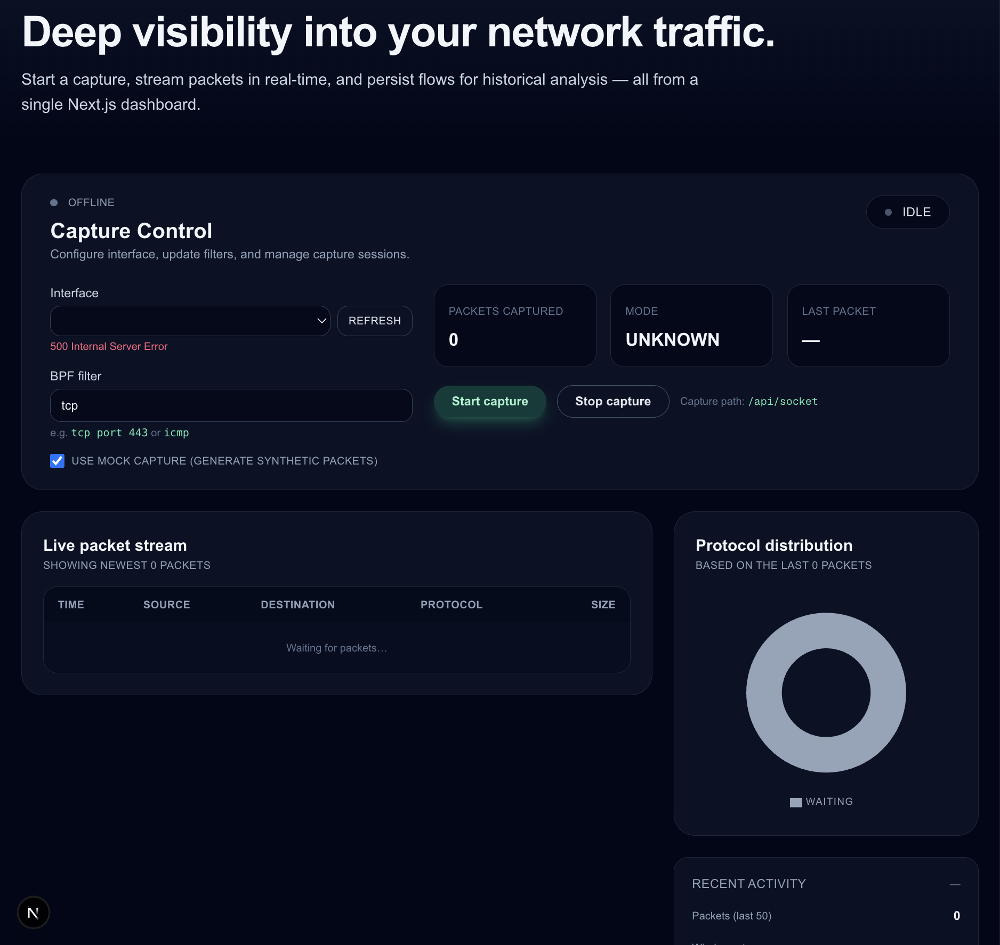

# Packly

<div align="center">


</div>

<div align="center">

## 🚀 Development Status


## 🌐 Connect With Me

[](https://www.linkedin.com/in/pierre-mvita/)
[](https://pierre-mvita.vercel.app/)
[](mailto:Petermvita@hotmail.com)

## 💻 Core Framework


## 💾 Database & ORM


## 🔌 Networking & Communication


## 📊 Monitoring & Observability


## 🧪 Testing & Quality


## 🐳 DevOps


</div>

Packly is a full-stack packet inspector: capture frames with libpcap, decode protocol stacks, persist flows in PostgreSQL, and visualise everything from a Next.js dashboard. Capture utilities, APIs, background jobs, and UI all live in one codebase so you can iterate quickly and still deploy with confidence.

## Highlights

- **Real-time capture pipeline** powered by `cap`, `Socket.IO`, and a resilient capture manager with mock fallback for development.
- **PostgreSQL persistence** with Prisma models for sessions, packets, flows, and background rollups that summarise recent activity.
- **Rich dashboard** built with Next.js App Router, React Query, Zustand, and Recharts for packet tables, protocol breakdowns, and live metrics.
- **Observability baked-in**: structured Pino logging, Prometheus-compatible metrics (`/api/metrics`), and scheduled summarisation jobs.
- **Quality gates**: Vitest + Testing Library suites, ESLint, and a GitHub Actions workflow that runs linting and tests on every push/PR.
- **Deployment-ready**: Dockerfile and `docker-compose.yml` for running the app alongside PostgreSQL (with packet capture capabilities enabled).

See `docs/architecture.md` for component responsibilities and data-flow diagrams.

## Screenshots


<!-- Add screenshots of the dashboard, packet tables, protocol breakdowns, etc. -->
<!-- Example format:


-->

## Prerequisites

| Requirement | Notes |
|-------------|-------|
| **Node.js 20+** | Development and CI use Node 20. |
| **npm** | Included with Node (lockfile is `package-lock.json`). |
| **libpcap** | Required by the `cap` binding.<br/>macOS: `brew install libpcap`<br/>Ubuntu/Debian: `sudo apt-get install libpcap-dev`<br/>Fedora: `sudo dnf install libpcap-devel` |
| **Packet capture privileges** | macOS: `sudo dseditgroup -o edit -a $(whoami) -t user access_bpf` then log out/in.<br/>Linux: run the app with `CAP_NET_ADMIN` or via `sudo setcap cap_net_admin=eip $(which node)`. |

## Quick start

```bash
# 1. Install dependencies
npm install

# 2. Copy environment template and edit it
cp .env.example .env.local

# 3. Run migrations (requires DATABASE_URL)
npm run prisma:migrate -- --name init

# 4. Generate Prisma client + start the dev server
npm run prisma:generate
npm run dev
```

Visit [http://localhost:3000](http://localhost:3000) and use the dashboard to select a NIC, configure BPF filters, and start/stop captures. Enable **“Use mock capture”** to exercise the UI without root privileges or libpcap installed.

## Environment variables

All configuration loads from `.env.local` or the container environment. Key entries:

| Variable | Purpose |
|----------|---------|
| `DATABASE_URL` | PostgreSQL connection string. |
| `CAPTURE_INTERFACE` | Default interface when the UI first loads (e.g. `en0`, `eth0`). |
| `CAPTURE_FILTER` | Default BPF filter (`tcp`, `tcp port 80`, etc.). |
| `CAPTURE_PROMISCUOUS` | Enable promiscuous mode (default `true`). |
| `SUMMARY_ROLLUP_INTERVAL_MINUTES` | Interval for background traffic summaries. |
| `SOCKET_IO_PATH` / `NEXT_PUBLIC_SOCKET_PATH` | Socket.IO handshake path (defaults to `/api/socket`). |
| `NEXT_PUBLIC_DEFAULT_INTERFACE`, `NEXT_PUBLIC_DEFAULT_FILTER` | Client defaults for the dashboard. |

The repository also creates a placeholder `.env` file (intentionally empty) to signal that secrets belong in `.env.local`.

## Key commands

| Command | Description |
|---------|-------------|
| `npm run dev` | Start Next.js in development mode. |
| `npm run build` / `npm run start` | Production build and runtime. |
| `npm run lint` | ESLint via `next lint`. |
| `npm run test` / `npm run test:watch` | Vitest suites (Node environment by default). |
| `npm run coverage` | Generate lcov + text coverage reports. |
| `npm run prisma:migrate -- --name <msg>` | Apply migrations to the configured database. |
| `npm run prisma:generate` | Regenerate the Prisma client (`src/generated/prisma`). |

GitHub Actions (`.github/workflows/ci.yml`) runs `npm run lint` and `npm run test` on pushes and pull requests targeting `main`/`master`.

## API surface

| Endpoint | Method | Description |
|----------|--------|-------------|
| `/api/capture/interfaces` | `GET` | Enumerate capture-capable network interfaces. |
| `/api/capture/status` | `GET` | Current capture manager state & metrics. |
| `/api/capture/start` | `POST` | Start a capture session (`device`, `filter`, `useMock`, etc.). |
| `/api/capture/stop` | `POST` | Stop the running capture session. |
| `/api/capture/history` | `GET` | Placeholder (501) until historical queries ship. |
| `/api/socket` | `Socket.IO` | Realtime stream (status + packets + errors). |
| `/api/metrics` | `GET` | Prometheus metrics (Pino logs note status transitions). |

Socket event names: `capture:status`, `capture:packet`, `capture:error`, plus `capture:start` / `capture:stop` client emissions for control.

## Observability & background jobs

- **Logging** uses `pino` with service metadata; messages originate from the capture manager, persistence coordinator, and summary scheduler.
- **Metrics** powered by `prom-client`: total packets, packet size histogram, and capture status gauges.
- **Summary scheduler** (`src/server/background/summary-scheduler.ts`) runs every `SUMMARY_ROLLUP_INTERVAL_MINUTES` to persist rollups via Prisma (top talkers, protocol breakdowns).

Expose `/api/metrics` to your Prometheus or use Docker compose to bind it to your monitoring stack.

## Docker & Compose

```bash
# Build the production image
docker build -t packly .

# Or run with Postgres using compose (requires root or NET_ADMIN capability)
docker compose up --build
```

`docker-compose.yml` provisions:

- `app`: Packly (port 3000) with `cap_add: NET_ADMIN` so libpcap can access the host NICs.
- `db`: PostgreSQL 16 with health checks and a persistent volume (`postgres-data`).

Provide a `.env.local` file (referenced via `env_file`) or override variables inline.

## Project structure

```
app/                 # Next.js App Router pages & API endpoints
docs/                # Architecture reference
prisma/              # Prisma schema & migrations
src/
  capture/           # cap wrappers, session manager, parsers, mocks
  db/                # Prisma client + repositories
  features/          # UI feature modules (live dashboard)
  observability/     # Logger, metrics registry
  server/            # Capture manager, persistence, background jobs
tests/               # Vitest suites
```

## 📊 GitHub Stats

<div align="center">


</div>

## Roadmap snapshot

- [x] Capture utilities with fallback mock mode.
- [x] Live Socket.IO stream & REST control plane.
- [x] Prisma schema + repositories + background summaries.
- [x] Dashboard (tables, charts, rate metrics).
- [x] Metrics, logging, Prometheus-exporting endpoint.
- [x] Vitest suites + CI pipeline.
- [x] Dockerfile & Compose setup.
- [ ] Historical queries & playback UI.
- [ ] Authentication / RBAC for multi-user deployments.
- [ ] Alerting rules & webhook integrations.

Refer to `packet.plan.md` for the full implementation roadmap.
